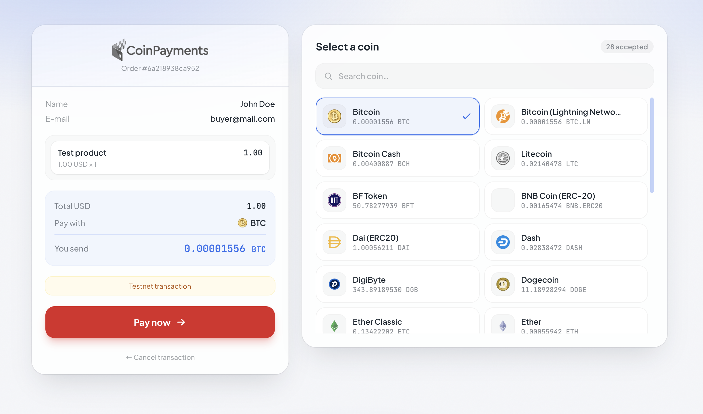
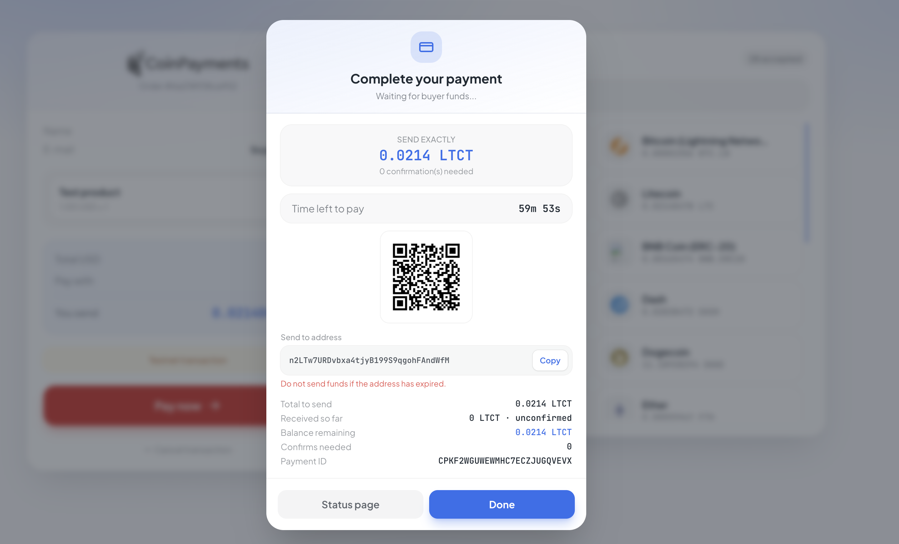
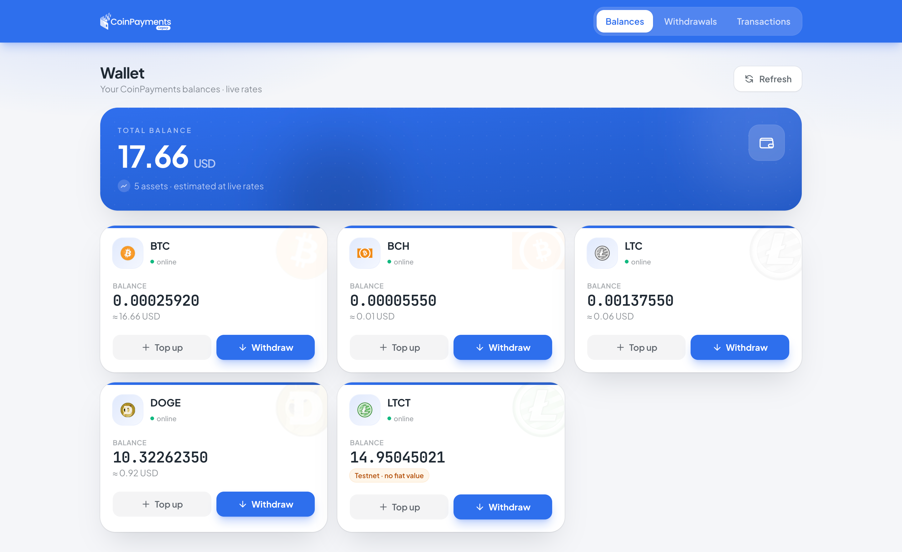
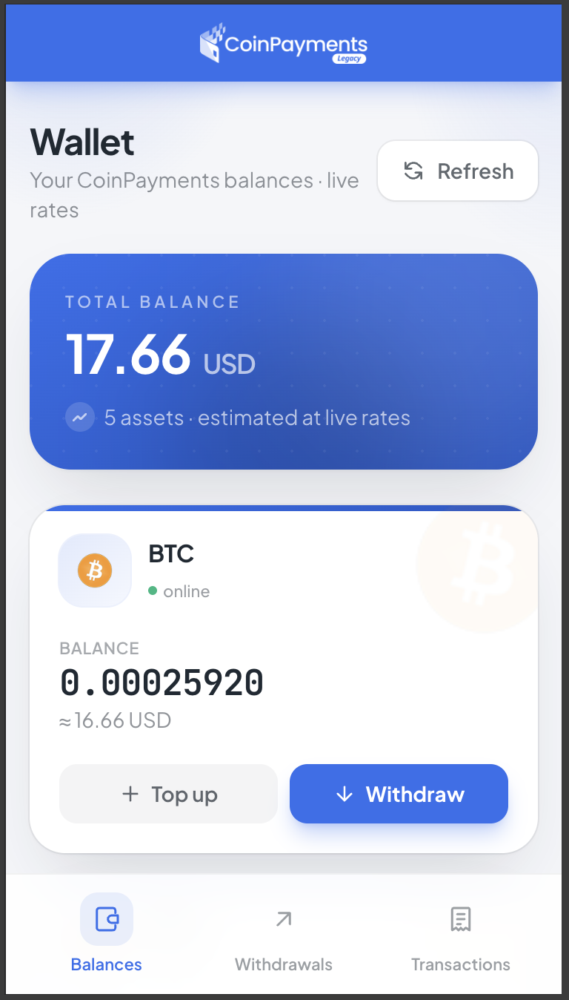
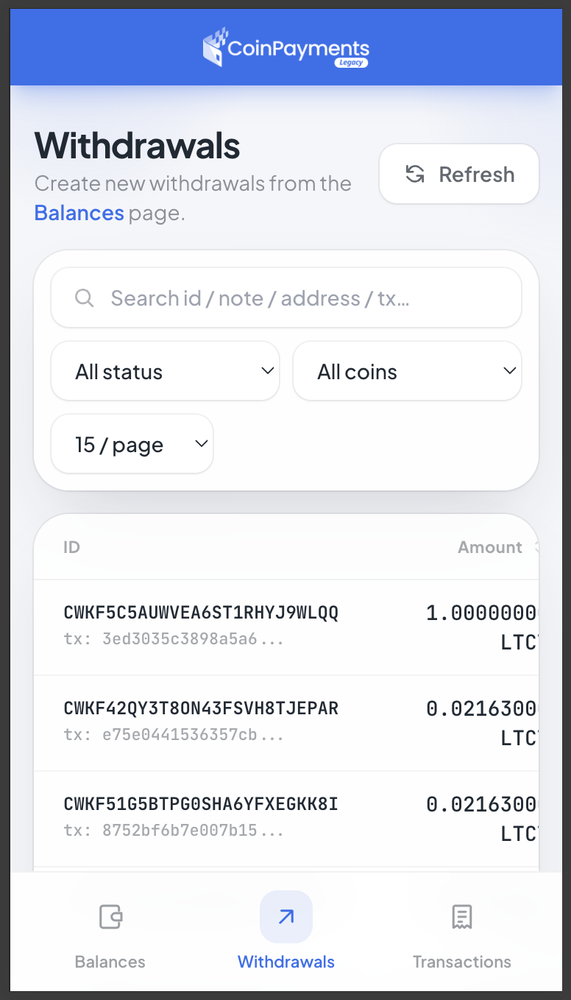
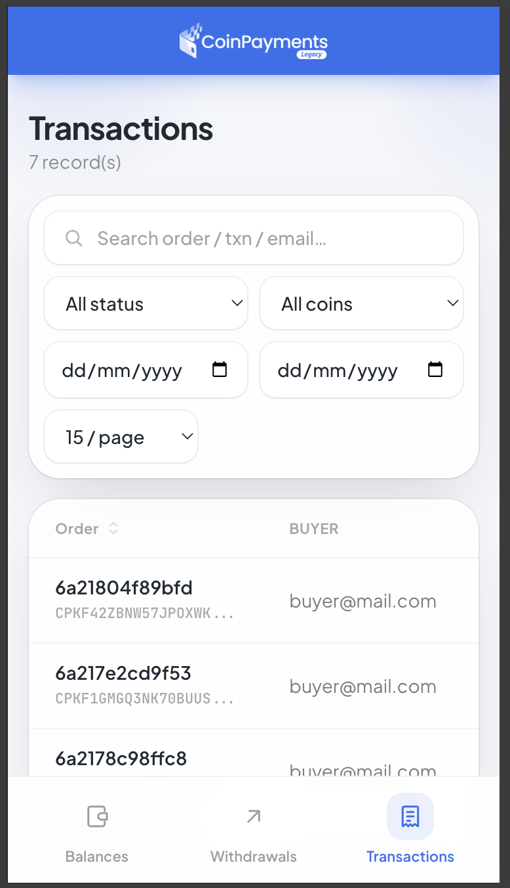
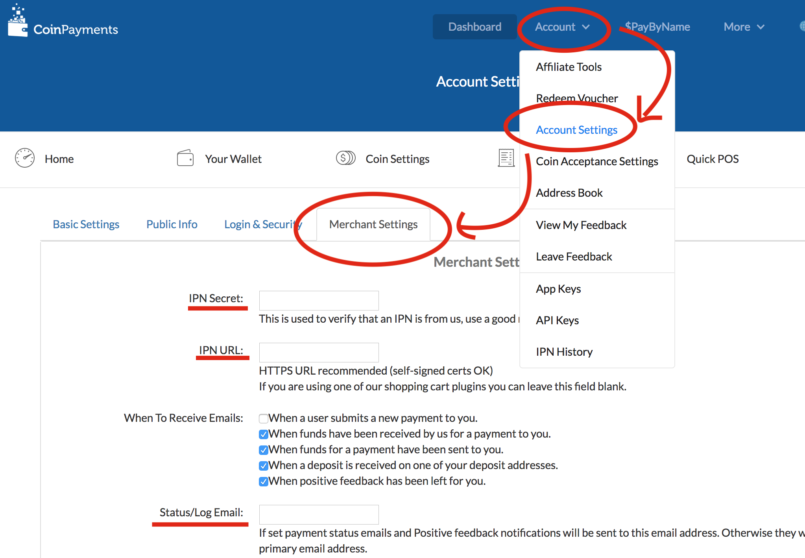

# CoinPayments Legacy for Laravel 11/12/13

[](https://packagist.org/packages/hexters/coinpayment)
[](https://packagist.org/packages/hexters/coinpayment)
[](https://packagist.org/packages/hexters/coinpayment)

[](https://legacy.coinpayments.net/index.php?ref=3dc0c5875304cc5cc1d98782c2741cb5)

Accept cryptocurrency payments in Laravel through [CoinPayments.net](https://legacy.coinpayments.net/index.php?ref=3dc0c5875304cc5cc1d98782c2741cb5) — a polished **Livewire** checkout, real-time status, IPN handling, and a standalone admin panel for balances, withdrawals and transactions.

> **v4** is a full rewrite: Laravel 11/12/13 & PHP 8.2+, **Livewire 3 + Alpine** (no Node/Vue/webpack build step), all API calls go through Laravel's `Http` client with TLS verification, and both the checkout and admin pages are **fully standalone** (Tailwind via CDN) — they never inherit your app's styling; only the **colors** are configurable.

## Screenshots



<p align="center"><em>Crypto checkout — coin picker with live search, QR &amp; address.</em></p>

|  Real-time payment modal  |  Admin dashboard  |
|:-------------------------:|:-----------------:|
|  |  |

#### Mobile — responsive with a bottom navigation bar

|  Balances  |  Withdrawals  |  Transactions  |
|:----------:|:-------------:|:--------------:|
|  |  |  |

## Features

- 🛒 **Livewire checkout** — coin picker with live search, QR + address, copy-to-clipboard
- ⏱ **Real-time status** — the payment modal polls until complete (configurable interval), with a countdown timer
- 🧩 **Partial-payment aware** — shows the remaining amount to send instead of a confusing "waiting"
- 🔔 **IPN + job listener** — react to transaction updates in your own queued job
- 🔁 **`coinpayment:sync` command** — poll pending transactions (and auto-expire overdue ones) when IPN isn't reachable; schedule it as a cron
- 🛠 **Standalone admin panel** (gate protected): wallet dashboard with fiat valuation, withdrawals (history, detail, cancel) and a full transactions table (search, filter, sort, pagination)
- 🎨 **Themeable** — change only the colors via config; pages never inherit your app CSS
- 📱 **Mobile-friendly** — bottom navigation bar on small screens

### Version support
| package | laravel |
|-|-|
| v1.x | 5.6 |
| v2.x | 5.8 – 6.x |
| v3.x | 8.x |
| **v4.x** | **11.x · 12.x · 13.x** |

> ℹ️ This package targets the CoinPayments **legacy v1 Merchant API** (`coinpayments.net/api.php`, public/private key + HMAC-SHA512). It is not the new v2 REST API.

## Requirements

- **PHP** 8.2+
- **Laravel** 11, 12 or 13 — `livewire/livewire` ^3.5 is pulled in automatically
- A **database** (the package ships migrations) and, if you use the listener job, a configured **queue** + running `queue:work`
- A [CoinPayments](https://legacy.coinpayments.net/index.php?ref=3dc0c5875304cc5cc1d98782c2741cb5) account with **Merchant API keys**

## How it works

1. You generate a payment link → the buyer lands on the Livewire checkout.
2. The buyer picks a coin and pays; the modal tracks status in real time.
3. CoinPayments notifies your app via **IPN** — or you poll with `coinpayment:sync` (cron) when IPN can't reach you.
4. The package verifies the callback, updates the transaction row in your DB, and dispatches `App\Jobs\CoinpaymentListener`.
5. Your job fulfills the order based on the transaction **status**.

## Installation

```bash
composer require hexters/coinpayment
```

Run the interactive installer (writes API keys to `.env`, publishes the config & assets, and migrates):

```bash
php artisan coinpayment:install
```

Or publish manually:

```bash
php artisan vendor:publish --tag=coinpayment-config
php artisan vendor:publish --tag=coinpayment-assets
php artisan vendor:publish --tag=coinpayment-job    # optional: App\Jobs\CoinpaymentListener
php artisan vendor:publish --tag=coinpayment-views  # optional: Blade views
```

Then run the migrations (the installer does this for you):

```bash
php artisan migrate
```

### Environment variables

```dotenv
COINPAYMENT_PUBLIC_KEY=your-public-key
COINPAYMENT_PRIVATE_KEY=your-private-key
COINPAYMENT_CURRENCY=USD            # default fiat currency

# IPN (optional but recommended for production)
COINPAYMENT_IPN_ACTIVATE=true
COINPAYMENT_MARCHANT_ID=your-merchant-id
COINPAYMENT_IPN_SECRET=your-ipn-secret
COINPAYMENT_IPN_DEBUG_EMAIL=you@example.com
```

## Creating a payment link

```php
use Hexters\CoinPayment\CoinPayment;

$transaction = [
    'order_id'     => uniqid(),          // your invoice number (required)
    'amountTotal'  => 37.5,              // total in your default currency (required)
    'note'         => 'Transaction note',
    'buyer_name'   => 'John Doe',
    'buyer_email'  => 'buyer@mail.com',
    'redirect_url' => url('/thank-you'), // after completion
    'cancel_url'   => url('/cart'),      // when cancelled
    'items'        => [                   // optional; if provided, subtotals must sum to amountTotal
        ['itemDescription' => 'Product one', 'itemPrice' => 7.5, 'itemQty' => 1, 'itemSubtotalAmount' => 7.5],
        ['itemDescription' => 'Product two', 'itemPrice' => 10,  'itemQty' => 3, 'itemSubtotalAmount' => 30],
    ],
];

return redirect(CoinPayment::generatelink($transaction));
```

`generatelink()` returns a URL to the Livewire checkout page (`/coinpayment/make/{payload}`) where the buyer picks a coin and pays. The payment modal then updates in real time until complete.

## Reacting to transactions

Publish `App\Jobs\CoinpaymentListener` (tag `coinpayment-job`). It is dispatched — and queued — whenever a transaction is **created or updated** (checkout, IPN, manual sync, or expiry), so this is where you fulfill the order.

> The job implements `ShouldQueue`. Make sure a worker is running (`php artisan queue:work`) — otherwise the listener won't fire (the DB row is still updated regardless).

The job receives the transaction as an array. Key fields:

| field | description |
|-|-|
| `order_id` | your invoice number (use this to find your order) |
| `txn_id` | CoinPayments transaction id |
| `status` / `status_text` | numeric status (see below) + human text |
| `coin`, `amountf`, `receivedf` | coin, amount due, amount received (floats) |
| `buyer_email`, `buyer_name` | buyer info |
| `payload` | the custom array you passed to `generatelink()` |
| `transaction_type` | `new` (first dispatch) or `old` (a later update) |

### Status codes

| status | meaning |
|-|-|
| `0` | Waiting for buyer funds (a `received` between 0 and the amount = **partial**) |
| `1` | Funds received & confirmed, sending to you |
| `100` | **Complete** — safe to fulfill |
| `< 0` | Cancelled / timed out / expired |

### Example

```php
// app/Jobs/CoinpaymentListener.php
public function handle(): void
{
    $tx = $this->transaction; // array

    $order = Order::where('invoice', $tx['order_id'])->first();
    if (! $order) {
        return;
    }

    match (true) {
        (int) $tx['status'] >= 100 => $order->markAsPaid(),       // complete
        (int) $tx['status'] < 0    => $order->markAsCancelled(),  // cancelled / expired
        default                    => $order->markAsPending(),     // waiting / confirming
    };
}
```

Point the package at a different job — or disable dispatching — via config:

```php
// config/coinpayment.php
'listener' => \App\Jobs\CoinpaymentListener::class, // or null to disable
```

## IPN

CoinPayments posts updates to `POST /coinpayment/ipn`. The package registers this route and **already excludes it from CSRF verification**, so no extra setup is needed in Laravel 11+.

**Security:** every IPN is verified before it touches your data — the merchant ID is checked and the raw request body is validated against the `HMAC` header using **HMAC-SHA512** with your IPN secret (`hash_equals`). Invalid callbacks are rejected with `401`. All outbound API calls use Laravel's `Http` client over TLS.

Enable IPN in the config/installer and set the **IPN URL** + **IPN Secret** under *Account → Account Settings → Merchant Settings* in your CoinPayments dashboard:



## Syncing without IPN (cron)

When IPN can't reach your app (e.g. local dev), poll instead:

```bash
php artisan coinpayment:sync                 # all pending transactions
php artisan coinpayment:sync --id=CPXXXXXXX   # a single transaction
```

It also marks unpaid transactions whose payment window has passed as **expired** (and dispatches the listener). Schedule it in `routes/console.php`:

```php
use Illuminate\Support\Facades\Schedule;

Schedule::command('coinpayment:sync')->everyMinute()->withoutOverlapping();
```

## Admin panel

A standalone, gate-protected panel ships with the package:

| route | description |
|-|-|
| `/coinpayment/admin` | wallet dashboard — balances + fiat valuation, top-up & withdraw |
| `/coinpayment/admin/withdrawals` | withdrawal history, detail, single-refresh & cancel |
| `/coinpayment/admin/transactions` | transactions table — search, filter, sort, pagination |

Access is **fail-closed**: it requires the configured middleware *and* an authorization gate. Define the gate (until you do, the panel returns `403`):

```php
use Illuminate\Support\Facades\Gate;

Gate::define('coinpayment-admin', fn ($user) => $user->is_admin);
```

```php
// config/coinpayment.php
'admin' => [
    'prefix'     => 'coinpayment/admin',
    'middleware' => ['web'],              // package handles auth + gate; add 'auth' to use your app's default login redirect
    'gate'       => 'coinpayment-admin',
    'redirect'   => null,                 // where to send guests: a route name or URL (null = your app's "login" route)
],
```

The guest redirect is fully customizable — point `redirect` at a route name or URL:

```php
'redirect' => 'login',            // a named route
'redirect' => '/admin/sign-in',   // or a path/URL
```

## Theming (colors only)

Both pages are fully standalone and never inherit your application's styles. You may only customize the colors, injected as CSS variables:

```php
// config/coinpayment.php
'theme' => [
    'background'   => '#eef1f7',
    'card'         => '#ffffff',
    'text'         => '#0f1729',
    'primary'      => '#2f6fed',
    'primary_dark' => '#1f57c4',
    'danger'       => '#e02424',
    // Note: the "Pay" button is intentionally a fixed red and is NOT themeable.
],
```

## Other settings

```php
// config/coinpayment.php

// Default fiat currency for display & conversion.
'default_currency' => env('COINPAYMENT_CURRENCY', 'USD'),

// Coins excluded from fiat conversion / totals (testnet coins have no real value).
'fiat_exclude' => ['LTCT'],

// How often the checkout payment modal polls for status updates.
'poll_interval' => '5s',
```

## Manual status check & queries

```php
use Hexters\CoinPayment\CoinPayment;

// Refresh one transaction from CoinPayments (updates the DB, fires the listener).
CoinPayment::getstatusbytxnid('CPDA4VUGSBHYLXXXXXXXXXXXXXXX');

// Eloquent query helper.
CoinPayment::gettransactions()->where('status', 0)->get();
```

### The transaction model

`Hexters\CoinPayment\Entities\CoinpaymentTransaction` is a regular Eloquent model (table `coinpayment_transactions`). Useful columns:

| column | notes |
|-|-|
| `order_id` | your invoice number (unique) — link it to your own orders |
| `txn_id` | CoinPayments transaction id (unique) |
| `status`, `status_text` | see the status codes above |
| `coin`, `amount`, `amountf` | coin + amount due |
| `received`, `receivedf`, `recv_confirms` | amount received & confirmations |
| `amount_total_fiat`, `currency_code` | fiat total |
| `address`, `qrcode_url`, `status_url`, `time_expires` | payment details |
| `buyer_name`, `buyer_email` | buyer |
| `payload` | cast to `array` — the custom data from `generatelink()` |

It also has a `items()` relation (`coinpayment_transaction_items`: `description`, `price`, `qty`, `subtotal`, `currency_code`).

```php
use Hexters\CoinPayment\Entities\CoinpaymentTransaction;

$trx = CoinpaymentTransaction::with('items')->where('order_id', $invoice)->first();
```

## Testing on the Litecoin testnet (LTCT)

CoinPayments' sandbox uses **LTCT** (Litecoin Testnet). Get free coins from a testnet faucet (e.g. <https://tltc.bitaps.com/>) and send them to the invoice address — no local wallet required. LTCT is excluded from fiat totals by default.

## Troubleshooting

**`Unable to fetch supported coins` / API errors** — On the [CoinPayments API Keys](https://www.coinpayments.net/index.php?cmd=acct_api_keys) page, edit the key permissions and either whitelist your server IP under *Restrict to IP/IP Range* or leave it empty.

## Premium features

The package is **free to use in development**. On **production/staging** servers, the full coin list on the checkout plus the **withdrawal** and **transaction/withdrawal detail** views require a one-time license. You'll be prompted to activate when you go live — [get a license here](https://buymeacoffee.com/hexters/e/545129).

## Support

Found a bug or need help? Open an issue at **[github.com/hexters/CoinPayment/issues](https://github.com/hexters/CoinPayment/issues)**.

## License

Source-available. Free to use and develop with locally; production/staging use of the premium features requires a paid license (see [Premium features](#premium-features)). © Asep SS (hexters).
